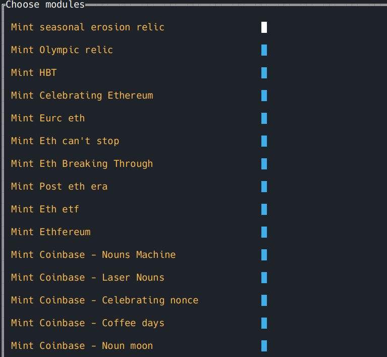

# Base onchain minter

## Installation

* ```shell
  go install
  go build
  ```
   Or you can just download compiled binary for your platform in release section. Then put binary and accounts.csv file in the same folder and run the program. The console interface will help you set up the script step by step.
##
* 